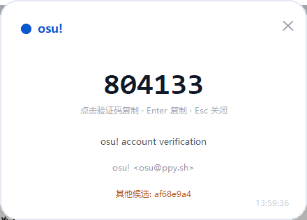

# QQ 邮箱验证码弹窗工具（IMAP IDLE 实时推送）

后台用 IMAP IDLE 实时监听 QQ 邮箱，收到含验证码的新邮件时**弹窗提醒**：显示发信平台（哪个平台的验证码）+ 验证码，并带一键复制按钮。邮件到达后秒级响应，不用轮询。



## 界面效果

- 一个小状态窗口：显示监听账号、当前状态（连接中 / 监听中 / 异常重连）、运行时间和最近事件列表。
- **最小化状态窗口（或点 X）会收进右下角系统托盘**：双击托盘图标恢复窗口，托盘右键菜单可退出。
- **单实例保护**：重复双击 `启动.bat` 或再次运行 `gui.py` 不会启动第二个实例，而是自动把已运行的窗口带到前台（即使窗口已最小化到托盘也能唤醒）。
- 收到验证码时弹出置顶圆角卡片：
  - 顶部：发信平台（如 QQ、微信、淘宝、招商银行 …）
  - 中间：大号验证码
  - **点击验证码即可复制**（回车/空格也可以），复制后自动关闭
  - 附带邮件主题、发件人和到达时间；可拖动卡片，右上角 ✕ 或 Esc 关闭
- 连续收到多封验证码邮件时，弹窗会排队逐个显示。

## 项目结构

| 文件 | 说明 |
|---|---|
| `gui.py` | 弹窗界面、系统托盘、单实例保护、状态窗口 |
| `main.py` | IMAP 监听、IDLE 推送、验证码提取、剪贴板 |
| `启动.bat` | Windows 一键启动（后台运行、自动隐藏窗口） |
| `config.example.json` | 配置模板（邮箱 + 授权码） |
| `requirements.txt` | 可选依赖（pyperclip / pystray / Pillow） |

> 注意：`启动.bat` 是 GBK 编码（中文 cmd 兼容），如需修改请用 ANSI/GBK 编码保存。

## 工作原理

1. 用 IMAP 协议（`imap.qq.com:993`）登录 QQ 邮箱，凭据为 **16 位授权码**（不是 QQ 密码）。
2. 进入 **IDLE 推送模式**：服务器一收到新邮件就主动推送通知，客户端立即唤醒。
3. 解析邮件正文（GBK/UTF-8 自动识别，兼容 HTML 拆字验证码），用正则匹配“验证码”“verification code”等关键词，兜底匹配独立 4/6 位数字。
4. 从邮件主题和发件人识别平台（内置 50+ 平台关键词，可在配置里覆盖/追加）。
5. 弹出窗口并响铃；已处理的邮件按 UID 记录，重启不会重复弹窗。

如果服务器不支持 IDLE（或 Python 版本低于 3.14），会自动降级为轮询模式（默认每 30 秒检查一次）。

## 环境要求

- Python 3.9+；**推荐 3.14+**（本机已装 3.14，使用内置的 IDLE 上下文管理器）
- QQ 邮箱已开启 IMAP 服务并生成授权码
- Windows / macOS / Linux 均可（界面基于 tkinter，Python 自带）

## 快速开始

### 0. 开箱即用版（推荐，Windows）

双击 **`启动.bat`**，或直接运行 **`dist\QQ验证码工具.exe`**（单文件，无需安装 Python）：

- **首次运行弹出设置向导**：引导开启 QQ 邮箱 IMAP、获取 16 位授权码、测试连接，保存后自动进入监听
- 之后直接进入监听；状态窗口和托盘右键都有“重新配置”入口
- 配置保存在 exe 同目录的 `config.json`，不会上传

想自己重新打包（比如改代码后）：运行 `build.bat`，产物在 `dist\QQ验证码工具.exe`。

### 1. 获取 QQ 邮箱授权码

1. 浏览器登录 [mail.qq.com](https://mail.qq.com)
2. 设置 → 账号 → “开启 IMAP/SMTP 服务”
3. 按提示发送短信验证，拿到 **16 位授权码**（形如 `xxxxxxxxxxxxxxxx`）

### 2. 配置

```powershell
cd D:\code\qq-mail-code-clipboard
Copy-Item config.example.json config.json
```

编辑 `config.json`，填入邮箱地址和授权码：

```json
{
  "email": "123456789@qq.com",
  "auth_code": "你的16位授权码"
}
```

也可以不写文件，直接用环境变量：`QQ_IMAP_EMAIL`、`QQ_IMAP_AUTH_CODE`。

### 3. 安装可选依赖

```powershell
pip install -r requirements.txt
```

不安装也能用：复制按钮会走系统自带的 `clip.exe` / PowerShell；不装 `pystray`/`Pillow` 时最小化窗口停留在任务栏而非托盘。

### 4. 启动

**最简单的方式：双击 `启动.bat`**。它会自动检查 Python 和配置，然后以后台方式启动工具并自动关闭自身窗口；右下角出现托盘图标，状态窗口显示监听状态。

> 托盘图标依赖 `pystray` + `Pillow`（已写入 `requirements.txt`）。没安装时工具也能用，只是最小化后停在任务栏而不是托盘。

```powershell
python gui.py
```

状态窗口显示“监听中（IDLE 推送）”即就绪。之后收到验证码会自动弹窗，点“复制”或直接按回车即可粘贴使用。

想完全隐藏控制台后台运行：

```powershell
pythonw gui.py
```

## 命令行模式（可选）

如果不想要窗口，也可以用命令行模式——检测到验证码后**自动复制到剪贴板**并响铃：

```powershell
python main.py --check    # 检查登录和 IDLE 支持
python main.py            # 监听，验证码自动进剪贴板
```

## 配置项

| 字段 | 说明 | 默认值 |
|---|---|---|
| `email` | QQ 邮箱完整地址 | 必填 |
| `auth_code` | 16 位授权码 | 必填 |
| `host` | IMAP 服务器 | `imap.qq.com` |
| `port` | IMAP SSL 端口 | `993` |
| `poll_interval` | 轮询间隔（秒），仅在降级轮询时生效 | `30` |
| `idle_duration` | 单次 IDLE 时长（秒），到期自动重新进入 IDLE | `1500` |
| `mark_seen` | 处理后把邮件标记为已读（仅命令行模式生效） | `false` |
| `state_file` | 已处理进度文件（含最新 UID） | `.state.json` |
| `extra_patterns` | 追加自定义验证码正则（列表，需含捕获组） | `[]` |
| `platform_keywords` | 平台关键词覆盖/追加，格式见下方 | `{}` |

### 自定义平台识别

`platform_keywords` 里同名平台会覆盖内置关键词，新名字会追加到识别列表：

```json
{
  "platform_keywords": {
    "招商银行": ["招商银行", "cmbchina"],
    "某新平台": ["新平台关键词", "example.com"]
  }
}
```

## 命令行参数

`gui.py`：

| 参数 | 说明 |
|---|---|
| `-c / --config` | 配置文件路径（默认 `config.json`） |
| `--catchup` | 启动时也处理之前未处理的邮件 |

`main.py`：

| 参数 | 说明 |
|---|---|
| `--check` | 检查配置、登录、IDLE 支持和剪贴板后端后退出 |
| `--catchup` | 启动时也处理之前未处理的邮件 |
| `--poll-only` | 强制轮询，不用 IDLE |
| `--once` | 处理完当前新邮件后退出 |
| `--selftest` | 运行验证码提取自检（无需配置） |
| `-v` | 调试日志 |

## 常见问题

- **登录失败**：确认用的是 16 位授权码而不是 QQ 密码；确认邮箱已开启 IMAP 服务。
- **最小化没有收进托盘**：确认已执行 `pip install -r requirements.txt`（需要 pystray + Pillow）。
- **没有实时推送**：QQ 邮箱支持 IDLE；若日志显示“改用轮询模式”，通常是 Python 版本低于 3.14，或服务器未声明 IDLE 能力。
- **平台显示“未知平台”**：在 `config.json` 的 `platform_keywords` 里补上该平台的关键词。
- **验证码格式特殊**：在 `extra_patterns` 里追加正则，例如 `["(?:激活码)[^A-Za-z0-9]{0,4}?([A-Za-z0-9]{6})"]`。
- **重新处理旧邮件**：删除 `.state.json` 后再运行 `python gui.py --catchup`。

## 安全提示

`config.json` 中包含你的邮箱授权码（相当于密码），请勿提交到公开仓库或发给他人。项目自带的 `.gitignore` 已忽略该文件和状态文件。
